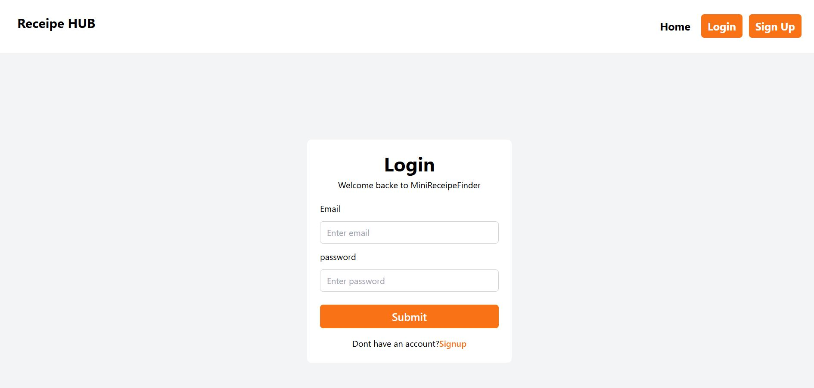
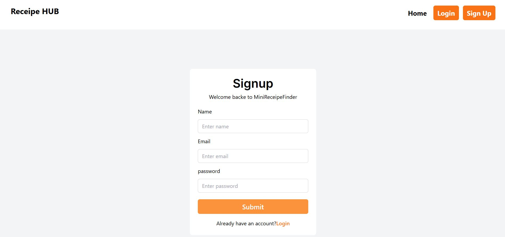
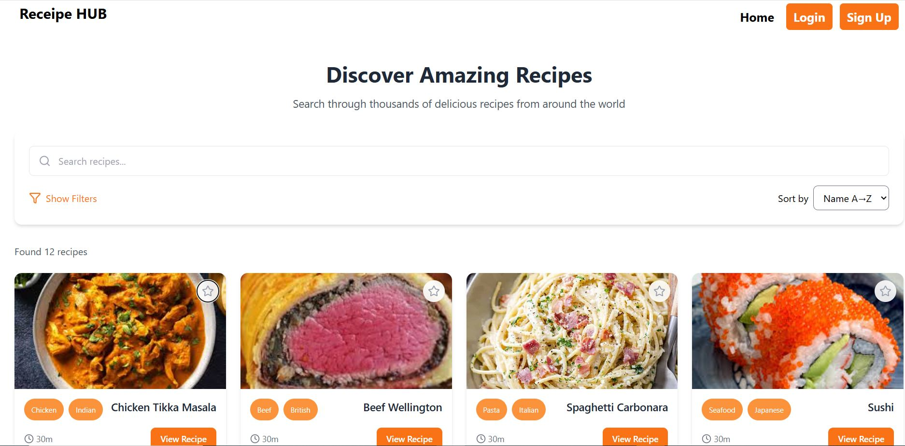
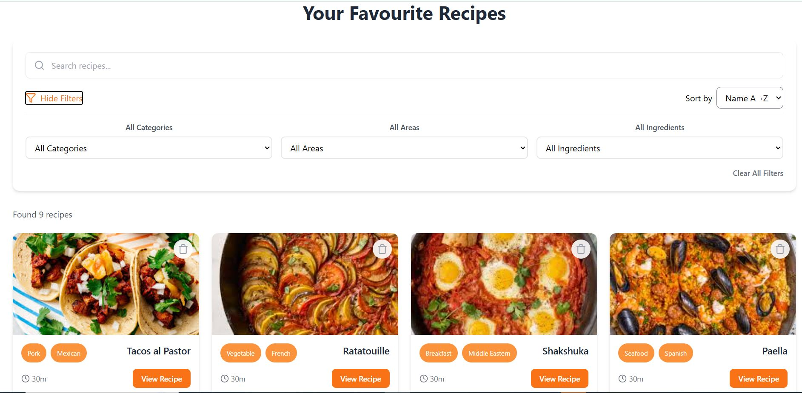
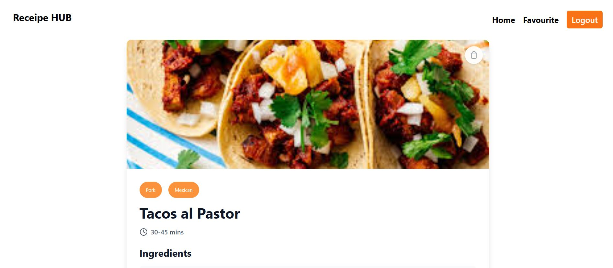
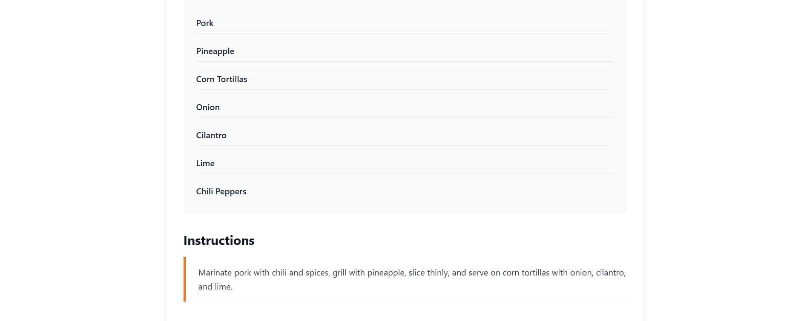

# Mini Recipe Finder with Favorites

A full-stack recipe application where users can search for meals, filter by category, area, or ingredient, and save their favorite recipes. Built with **React (Vite)**, **Tailwind CSS**, **Node.js**, **Express**,and  **MongoDB**.

---

##  Features

### Public Features
- Search recipes by name.
- Filter by **Category**, **Area**, or **Main Ingredient**.
- Client-side sorting (Name A→Z / Z→A).
- Client-side pagination with configurable page size.
- Responsive grid layout with loading, empty, and error states.

### Authentication
- User registration with **email verification** (via Nodemailer).
- JWT-based login for verified users.
- Auth middleware for protected routes.
- Logout clears JWT from localStorage.

### Favorites (User-Specific)
- Add recipes to favorites.
- List, search, sort, and paginate favorites.
- Prevent duplicate favorites.
- Delete favorites.

### UX / UI
- Responsive Tailwind UI.
- Loading spinners, error messages, empty states.
---

##  Tech Stack

- **Frontend:** React (Vite), Tailwind CSS, React Router, Axios
- **Backend:** Node.js, Express
- **Database:** MongoDB Atlas, Mongoose
- **Authentication:** JWT
- **Email:** Nodemailer
- **Deployment:** Vercel (Frontend), Railway (Backend)

---
##  Installation

### Backend

```bash
git clone <repo-url>
cd backend
npm install
Edit .env with your MongoDB URI, JWT secret, SMTP details
npm run dev
```

### Frontend

```bash
cd frontend
npm install
Set VITE_API_BASE_URL to your backend URL
npm run dev
```

---

##  Deployment

* **Frontend:** Vercel (set VITE\_API\_BASE\_URL to backend)
* **Backend:** Railway

---

##  Usage Flow

1. **Register:** Fill form → receive verification email → click link → verified.
2. **Login:** Only verified users can login.
3. **Search Recipes:** Use search + filters, sort and paginate.
4. **Favorites:** Add recipes to favorites. List, remove, and paginate favorites.

---

## Environment Variables

### Backend

```
PORT=...
MONGO_URI=...
JWT_SECRET=...
SMTP_HOST=smtp.gmail.com
SMTP_PORT=465
SMTP_USER=...
SMTP_PASS=...
APP_URL=https://frontend-domain.com
EMAIL_FROM="Recipe App <no-reply@yourapp.com>"
```

### Frontend

```
VITE_API_BASE_URL=https://backend-domain.com
```

---


##  Screenshots
### Login

### Signup

### Home Page

### FavouritePage

### Recipe Page



---

##  License

MIT License

